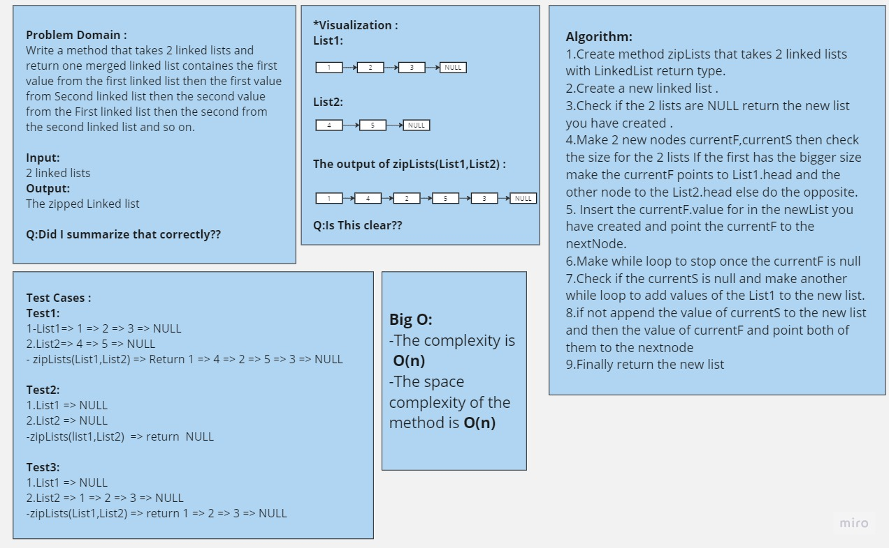
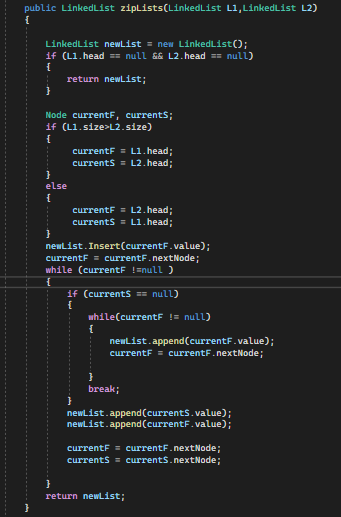
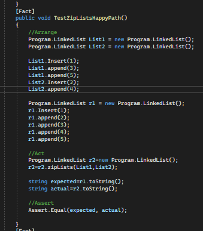
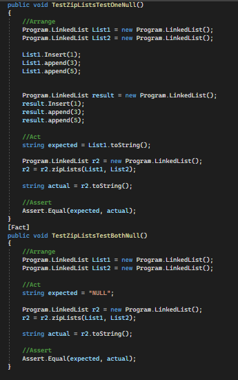

# Challenge Title
## ZipLists
+ I created a simple a method that takes 2 linked lists and return one merged linked list containes the first value from the first linked list then the first value from Second linked list then the second value from the First linked list then the second from the second linked list and so on

#
## Whiteboard Process

## Approach & Efficiency
+ Create method zipLists that takes 2 linked lists with LinkedList return type.
+ Create a new linked list .
+ Check if the 2 lists are NULL return the new list you have created .
+ Make 2 new nodes currentF,currentS then check the size for the 2 lists If the first has the bigger size make the currentF points to List1.head and the other node to the List2.head else do the opposite.
+ Insert the currentF.value for in the newList you have created and point the currentF to the nextNode.
+ Make while loop to stop once the currentF is null
+ Check if the currentS is null and make another while loop to add values of the List1 to the new list.
+ if not append the value of currentS to the new list and then the value of currentF and point both of them to the nextnode
+ Finally return the new list

## Solution
## The code 

## 
[Link to the code](./LinkedList/Program.cs)

## Testing

#
[Link to the testing](../testLinkedList/UnitTest1.cs)

