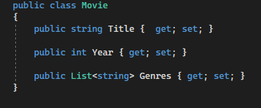
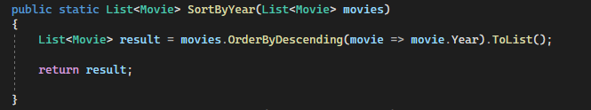
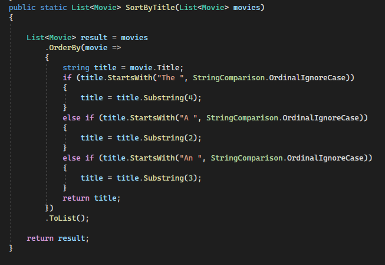

# Movie Sorting Program

This C# program allows you to manage a list of movies and sort them by year or title while optionally ignoring common prefixes like "A," "An," or "The" in titles. Below, we'll discuss the key components of this program.

## Movie Class

The `Movie` class represents a movie with the following properties:

- `Title`: A string representing the title of the movie.
- `Year`: An integer representing the release year of the movie.
- `Genres`: A list of strings representing the genres associated with the movie.

## Sort By Year Method

## Sort By Title Method

