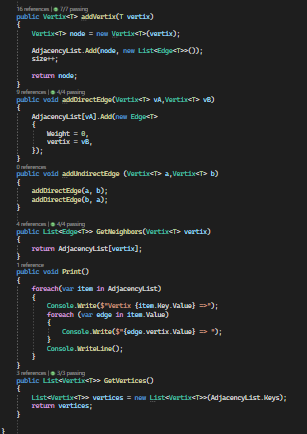

# Graphs
+ The `Graph<T>` class is a generic implementation of a graph data structure in C#. This class allows you to create and manipulate a graph with vertices of type `T` and edges between those vertices.

## Approach & Efficiency
### Classes 
+ `Vertix<T>` => Contains value with type T
+ `Edge<T>` => Contains the weight which is optional for each edge and a vertix<T>
+ `Graph<T>` = the graph class create a new Dictionary that has the vertix as a key and the edge as value , it also create an int size to determinw the size of the vertixes at the graph 

### Methods
+ `public Vertix<T> AddVertix(T vertexData)` => Adds a new vertex to the graph Takes The data of the new vertex and Returns the added `Vertix<T>` object.

+ `public void AddDirectEdge(Vertix<T> vA, Vertix<T> vB)`=> Adds a directed edge from vertex `vA` to vertex `vB` and takes `vA`: The source vertex `vB`: The destination vertex.

+ `public void AddUndirectedEdge(Vertix<T> a, Vertix<T> b)` => Adds an undirected edge between vertices `a` and `b` This is achieved by adding two directed edges, one from `a` to `b` and one from `b` to `a`.

+ `public List<Edge<T>> GetNeighbors(Vertix<T> vertex)` => Retrieves a list of all neighbors (adjacent vertices) of a given vertex.

+ `public List<Vertix<T>> GetVertices()` =>  Retrieves a collection of all vertices in the graph Returns a list of `Vertix<T>` objects representing all vertices in the graph.

+  `public void Print()` => Prints the adjacency list of the graph to the console.          

