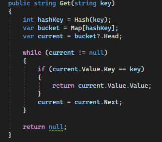
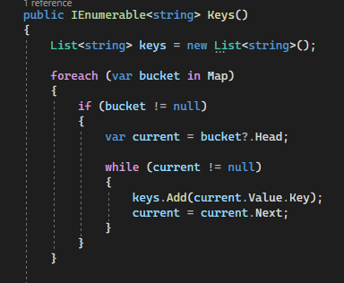

# Hashtable Implementation 

+ I implemented the Hashtable class with it's props.

## Overview

+ A Hashtable is a data structure that allows you to store key-value pairs, where keys are unique identifiers for the values. It uses a hash function to map keys to indices in an array (buckets), allowing for efficient key-value retrieval.

## Features

+ The Hashtable class implemented in this challenge offers the following features:

1. **set(key, value)**
   - Add or update a key-value pair in the Hashtable.
   - Handle collisions using chaining.
	

2. **get(key)**
   - Retrieve the value associated with a given key.
	

3. **has(key)**
   - Check if a key exists in the Hashtable.
	

4. **keys()**
   - Get a collection of all unique keys in the Hashtable.
	

5. **hash(key)**
   - Calculate the index in the collection for a given key.
	

