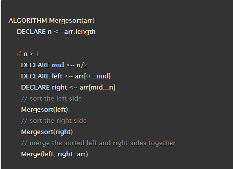
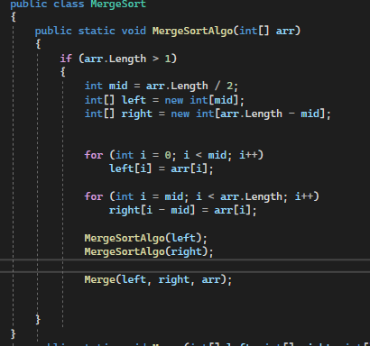
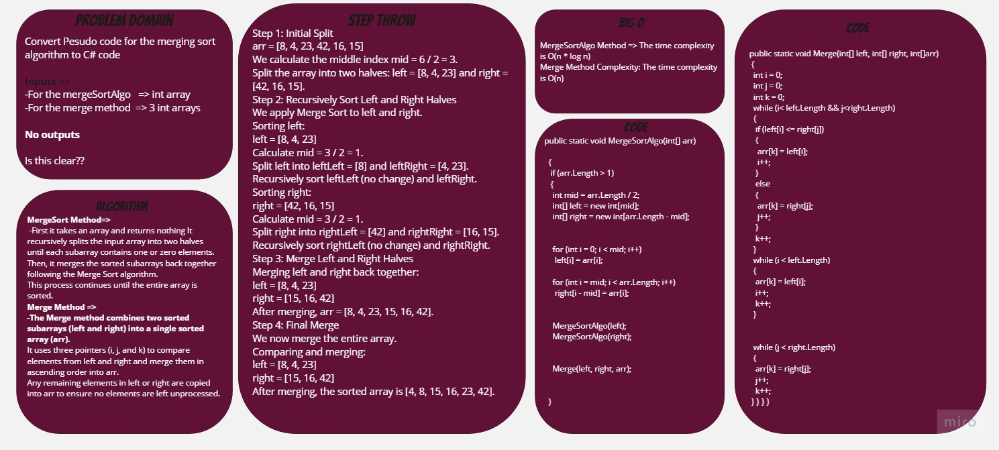
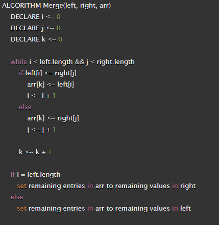
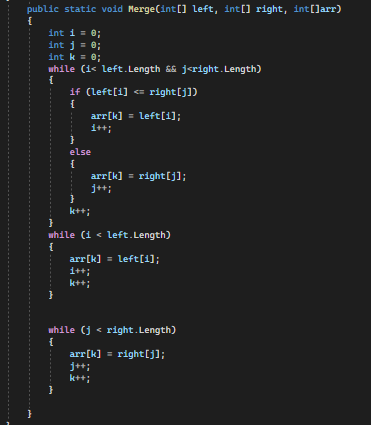
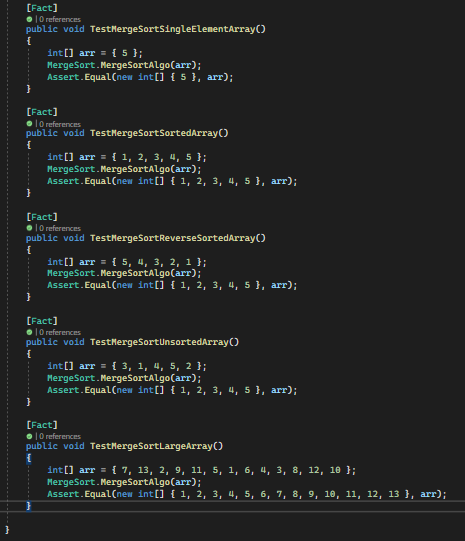

# Merge Sort Algorithm
## What Is a Merge Sort Algorithm?
+ Merge sort is one of the most efficient sorting algorithms. It is based on the divide-and-conquer strategy. Merge sort continuously cuts down a list into multiple sublists until each has only one item, then merges those sublists into a sorted list.

## Converting the Pseudo code into C# code =>
+ This it the Pesudo code of the Merge Sort method .

+ And this is it's code in C# =>     

+ First it takes an array and returns nothing It recursively splits the input array into two halves until each subarray contains one or zero elements.
Then, it merges the sorted subarrays back together following the Merge Sort algorithm.
This process continues until the entire array is sorted.

## WhiteBoard Process     
     
---------------------------------------------
+ The merge Pesudo code =>        
   
+ The code in C# =>     
 

+ The Merge method combines two sorted subarrays (left and right) into a single sorted array (arr).
It uses three pointers (i, j, and k) to compare elements from left and right and merge them in ascending order into arr.
Any remaining elements in left or right are copied into arr to ensure no elements are left unprocessed.

---------------------------------------------

## The testing 
+ 

