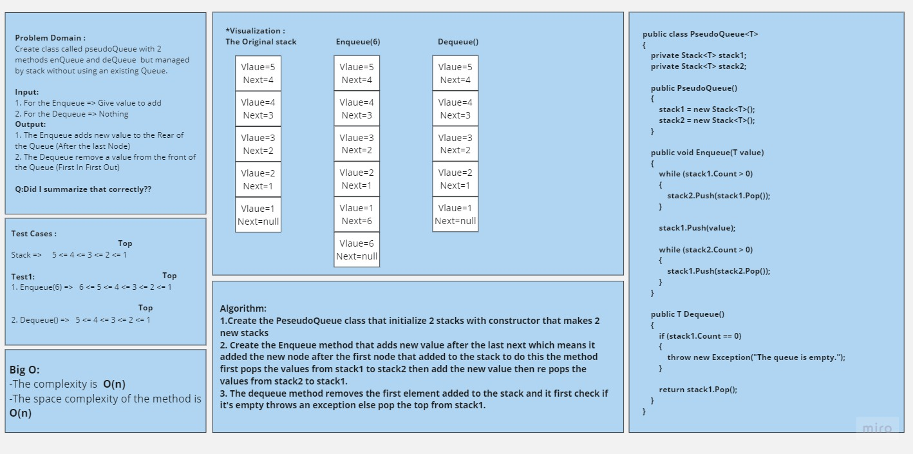
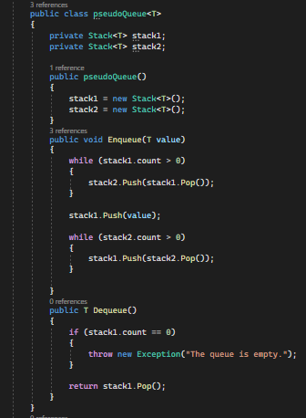

# Challenge Title
## Stack and Queue Pseudo
+ I created the Pseudo Queue class that do the methods of the queue (Dequeue,Enqueu) on 2 stacks.

## WhiteBoard Process

## Approach & Efficiency
+ Create the PeseudoQueue class that initialize 2 stacks with constructor that makes 2 new stacks 
+ Create the Enqueue method that adds new value after the last next which means it added the new node after the first node that added to the stack to do this the method first pops the values from stack1 to stack2 then add the new value then re pops the values from stack2 to stack1. 
+ The dequeue method removes the first element added to the stack and it first check if it's empty throws an exception else pop the top from stack1.

## Solution
+ The code

#
## 
[Link to the code](/LinkedList/Program.cs)

