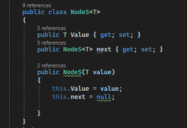
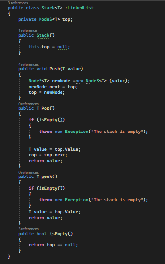
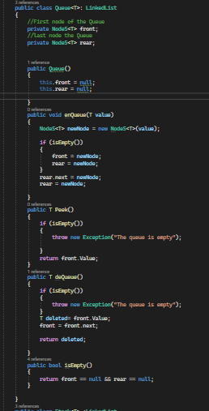

# Challenge Title
## Stack and Queue
+ First I have created a generic class Node  then I have created 2 classes  1. stack which includes some methods to deal with a stack Push,pop, peek and isEmpty and the second class is the Queue which also includes some methods to deal with queue enQueue, Dequeue, Peek and isEmpty.

## Approach & Efficiency
### The Node class
+ For the node class I made it generic to work with any type it takes 2 properities a value and Node to point to the next Node and also a constructor to set the value to the given value and the next to null

### The Stack class
+ For the **Stack class** I also made it as generic it includes methods and the Top property which is the top of the stack and once you create the stack it refers to null
+ **The isEmpty method** => this method is simple , it's just check if the stack is empty or not and returns boolean value if the top equals null return True that means the stack is Empty else return false. 
+ **The push method** => It's responsible for adding new value to the stack first create New node that takes the value you want to add , then make the next node for the new node points to the top then make the top equls the new node . That will add new node to the stack and make it the new top.
+ **The Pop method** => It's responsible for deleting value from the top of the stack First check if the stack is empty by calling the isEmpty method and throw an exception else Create new T value which points to the top (to store the value you want to delete from the stack) , Make the top = top.next then return the value you popped from the stack. 
+ **Finally the Peek method** => Its returns the top value at the stack , First check if empty else return top.value.    

### The Queue Class
+ It's generic class and inherits from the Linked list class, It contains 2 property the front which is the first node of the Queue and the rear the last Node of it.
+ **The isEmpty method** => this method is simple , it's just check if the Queue is empty or not and returns boolean value if the Front equals null return True that means the Queue is Empty. else return false. 
+ **The enQueue method** => used to add value to the Queue. First create new Node with the value you want to add, Check if the queue is empty to let the rear and front points to the new node else make the rear.next equals the new node and the rear = new node.
+ **The deQueue method** => To remove value from the end of the Queue . First check if the queue is empty and throw exception else make new T value to store the deleted value and make the front points to the next . Retrns the deleted Node 
+ **Finally the Peek method** => Its returns the Front value at the Queue , First check if empty else return Front.value.

## Solution
+ You can see each class code in the images at the previous point and here is a link for it.
## 
[Link to the code](/LinkedList/Program.cs)

## Testing

#

#

#

#
[Link to the testing](/testLinkedList/UnitTest1.cs)