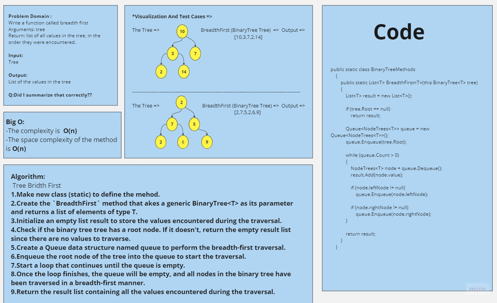
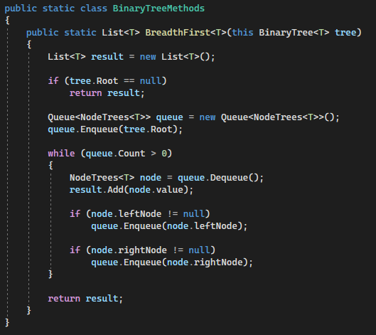
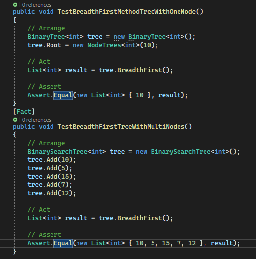

# Challenge Title
## Teee Breadth First
+ The `TreeBreadthFirst` method is a method that takes tree and return list that ordered depends on the breadth first order for the trees

## Approach & Efficiency
+ Make new class (static) to define the mehod.
+ Create the `BreadthFirst` method that akes a generic BinaryTree<T> as its parameter and returns a list of elements of type T.
+ Initialize an empty list result to store the values encountered during the traversal.
+ Check if the binary tree tree has a root node. If it doesn't, return the empty result list since there are no values to traverse.
+ Create a Queue data structure named queue to perform the breadth-first traversal.
+ Enqueue the root node of the tree into the queue to start the traversal.
+ Start a loop that continues until the queue is empty.
+ Once the loop finishes, the queue will be empty, and all nodes in the binary tree have been traversed in a breadth-first manner.
+ Return the result list containing all the values encountered during the traversal.
## WhiteBoard Process

## Solution

[Link to the code](/LinkedList/BinaryTreeMethods.cs)

## Testing

[Link to the testing](/testLinkedList/UnitTest1.cs)
