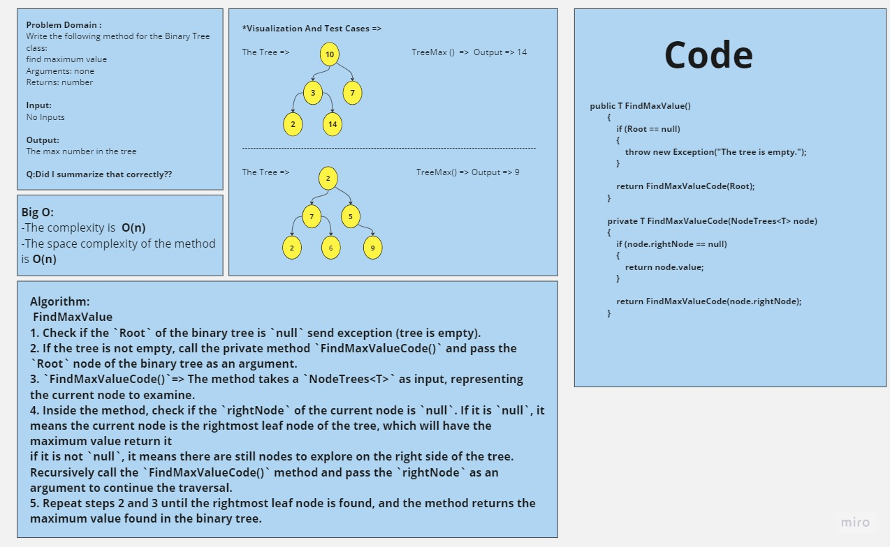
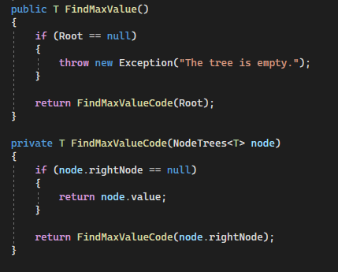
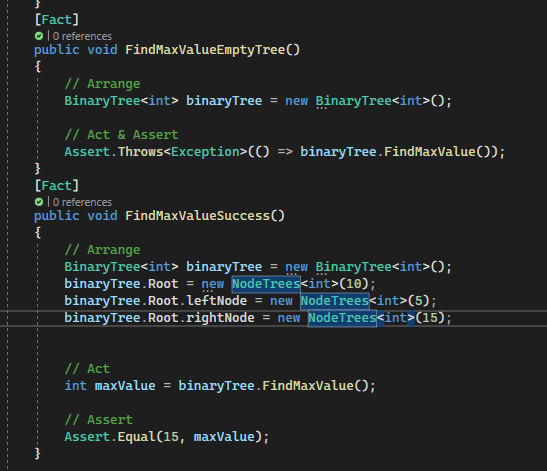

# Challenge Title
## Teee Max
+ The tree max method is responsible for find the maximum number in Binary Tree

## Approach & Efficiency
+ `FindMaxValue()` =>
+ Check if the `Root` of the binary tree is `null` send exception (tree is empty).
+ If the tree is not empty, call the private method `FindMaxValueCode()` and pass the `Root` node of the binary tree as an argument.
+ `FindMaxValueCode()`=>
+ The method takes a `NodeTrees<T>` as input, representing the current node to examine.
+ Inside the method, check if the `rightNode` of the current node is `null`. If it is `null`, it means the current node is the rightmost leaf node of the tree, which will have the maximum value return it
if it is not `null`, it means there are still nodes to explore on the right side of the tree. Recursively call the `FindMaxValueCode()` method and pass the `rightNode` as an argument to continue the traversal.
+ Repeat steps 2 and 3 until the rightmost leaf node is found, and the method returns the maximum value found in the binary tree.

## WhiteBoard Process

## Solution

[Link to the code](/LinkedList/Program.cs)

## Testing

[Link to the testing](/testLinkedList/UnitTest1.cs)
