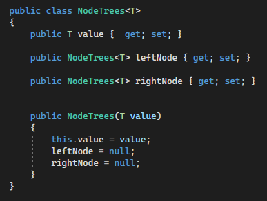
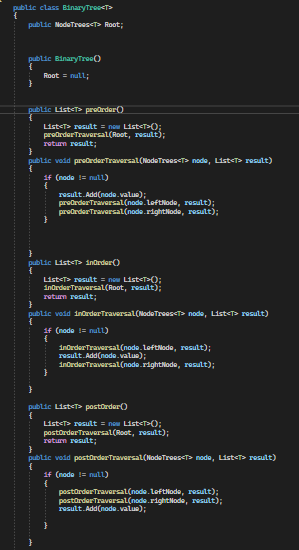
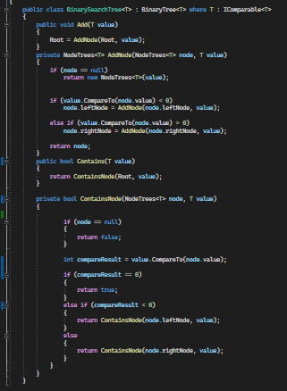
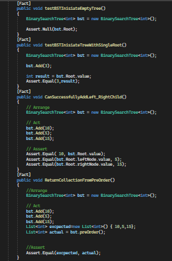
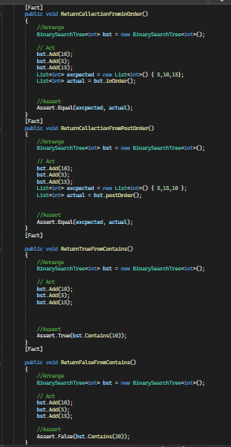

# Binary Search Tree Implementation

This repository contains the implementation of a Binary Search Tree in C#. It includes classes for a Node, Binary Tree, and Binary Search Tree.

### 1. NodeTrees

Create a `NodeTrees` class that represents a node in the binary tree. Each node has properties for the value stored in the node, the left child node, and the right child node.

### Binary Tree

Create a `BinaryTree` class that represents a binary tree data structure. It includes methods for each of the depth-first traversals:

- `PreOrder`: Performs a pre-order traversal that starts from the root => the left Nodes  => the right nodes
- `InOrder`: Performs an in-order traversal and returns an array of values ordered starting from left nodes => root => right nodes
- `PostOrder`: Performs a post-order traversal and returns an array of values ordered from the left nodes => the right nodes  => then the root

### Binary Search Tree

Create a `BinarySearchTree` class, a subclass of `BinaryTree`, with additional methods:

#### `Add`

- Arguments: `value` (of the generic type `T`).
- Returns: nothing.
- Description: Adds a new node with the specified value in the correct location in the binary search tree.

#### `Contains`

- Argument: `value` (of the generic type `T`).
- Returns: boolean.
- Description: Checks whether the given value exists in the binary search tree at least once.

[Link to the code](/LinkedList/Program.cs)

# Testing

[Link to the testing](/testLinkedList/UnitTest1.cs)
