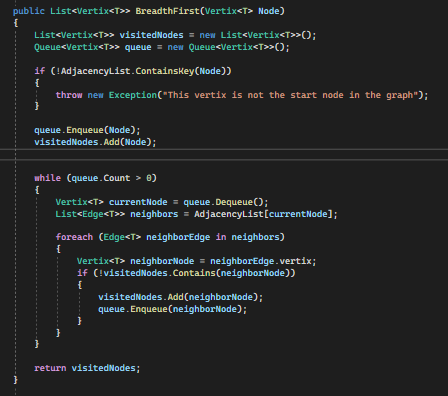

# Graph Breadth First
+ The breadth-first search or BFS algorithm is used to search a tree or graph data structure for a node that meets a set of criteria. It begins at the root of the tree or graph and investigates all nodes at the current depth level before moving on to nodes at the next depth.

## Whiteboard Process

## Approach & Efficiency

+ Create method BreadthFirst that takes Vertix Node and return list of vertix
+ Create new List and new Queue to sort visited values
+ Check if the node is in the graph and if not throw exception
+ Enqueu the node and add it also to the list you created
+ Loop throw the queue unless the Count of it = 0
+ Create new Vertix add to it the dequeued value from the queue.
+ Create list of edges to hold the neighbors of the current Node
+ Loop for each edge and check if it's visited or not and if not add it to the visited nodes list and Enqueu it
+ Return the Visited list
## Solution

### Code   

### Testing 

