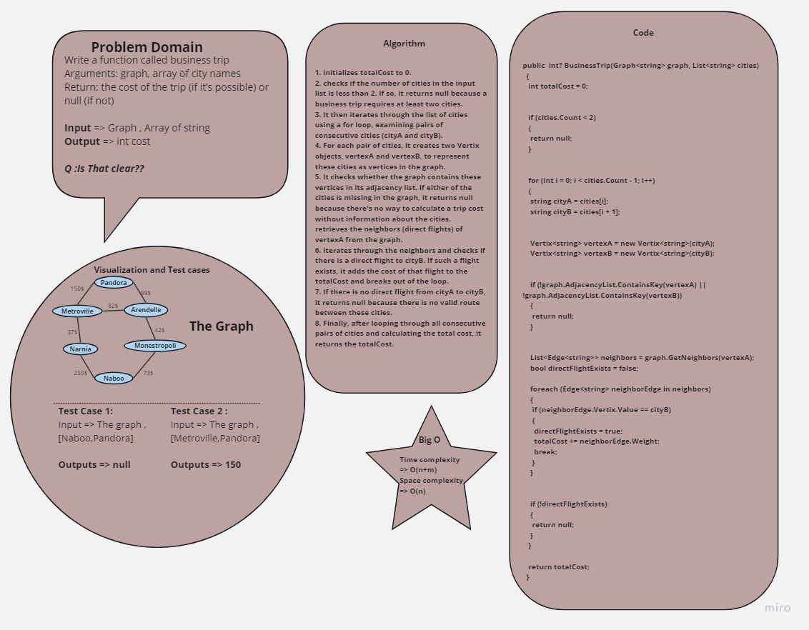

# Business Trip Cost 
+ This code implements a function called BusinessTrip that calculates the cost of a business trip using a given graph of cities and direct flight costs. The function determines whether the trip is possible with direct flights and computes the total cost.

## Whiteboard Process

## Approach And Efficiency

+ initializes totalCost to 0.
+ checks if the number of cities in the input list is less than 2. If so, it returns null because a business trip requires at least two cities.
+ It then iterates through the list of cities using a for loop, examining pairs of consecutive cities (cityA and cityB).
+ For each pair of cities, it creates two Vertix<string> objects, vertexA and vertexB, to represent these cities as vertices in the graph.
+ It checks whether the graph contains these vertices in its adjacency list. If either of the cities is missing in the graph, it returns null because there's no way to calculate a trip cost without information about the cities.
+ retrieves the neighbors (direct flights) of vertexA from the graph.
+ iterates through the neighbors and checks if there is a direct flight to cityB. If such a flight exists, it adds the cost of that flight to the totalCost and breaks out of the loop.
+ If there is no direct flight from cityA to cityB, it returns null because there is no valid route between these cities.
+ Finally, after looping through all consecutive pairs of cities and calculating the total cost, it returns the totalCost.