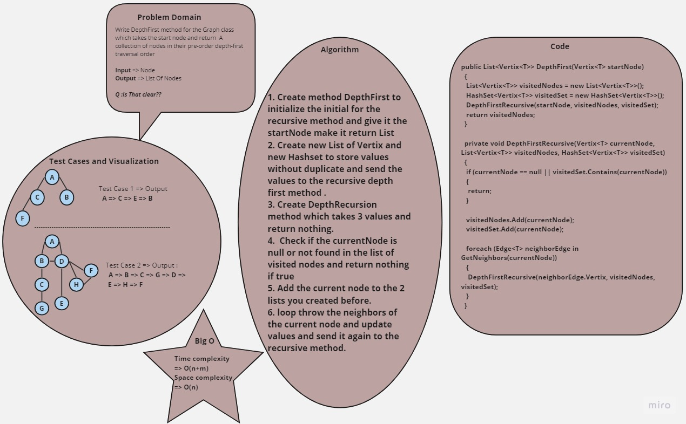
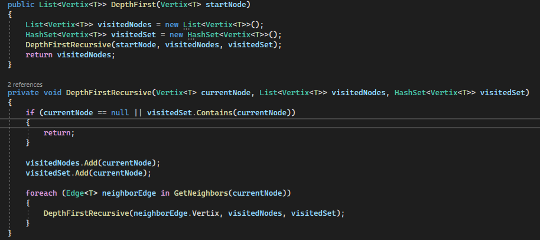
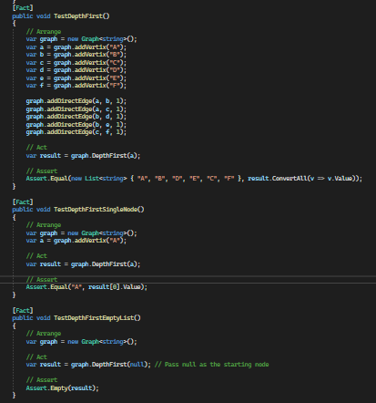

# Graph Depth First

+ The depth-first search or DFS algorithm is used to explore a tree or graph data structure, diving as far as possible along a branch before backtracking.

## Whiteboard Process

## Approach & Efficiency

+ Create method DepthFirst to initialize the initial for the recursive method and give it the startNode make it return List
+ Create new List of Vertix and new Hashset to store values without duplicate and send the values to the recursive depth first method .
+ Create DepthRecursion method which takes 3 values and return nothing.
+  Check if the currentNode is null or not found in the list of visited nodes and return nothing if true
+ Add the current node to the 2 lists you created before.
+ loop throw the neighbors of the current node and update values and send it again to the recursive method.
## Solution

### Code   

### Testing 

