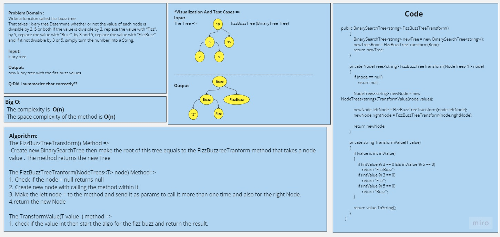
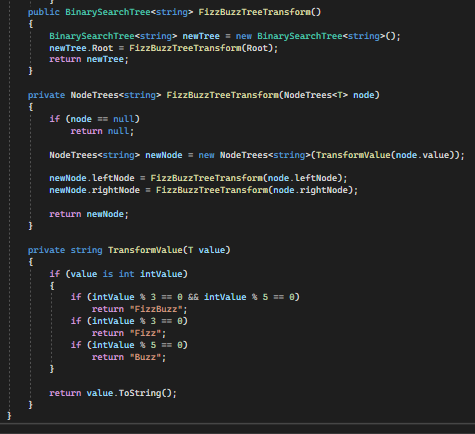
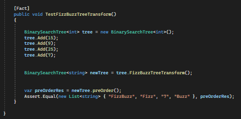

# Challenge Title
## Teee Fizz Buzz
+ Make method that takes tree and apply the FizzBuzz on it  => If the value divisible by 3 replace it with "Fizz" , divisible by 5 replace it with "Buzz" , divisible by both replace it with "FizzBuzz" and if none replace the value with the same but in string and return new tree with the new Values.

## WhiteBoard 

## Approach & Efficiency
### The FizzBuzzTreeTransform() Method =>
+ Create new BinarySearchTree then make the root of this tree equals to the FIzzBuzzreeTranform method that takes a node value . The method returns the new Tree

### The FizzBuzzTreeTranform `(NodeTrees<T> node)` Method=>
+ Check if the node = null returns null
+ Create new node with calling the method within it
+ Make the left node = to the method and send it as params to call it more than one time and also for the right Node.
+ return the new Node

### The TransformValue(T value  ) method =>
+ check if the value int then start the algo for the fizz buzz and return the result.

## Solution

[Link to the code](/LinkedList/BinarySearchTree.cs)

## Testing

[Link to the testing](/testLinkedList/UnitTest1.cs)