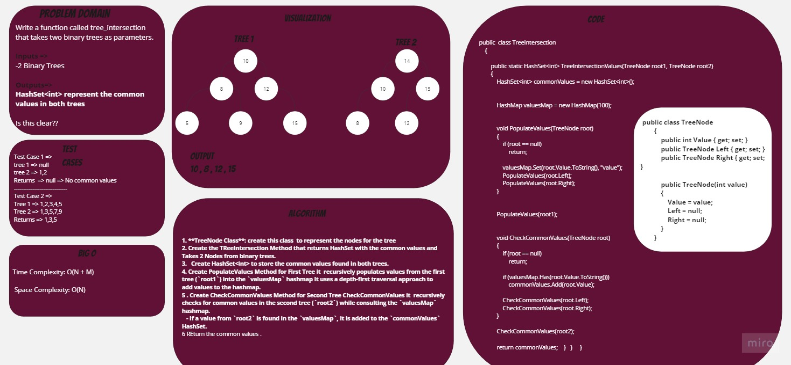
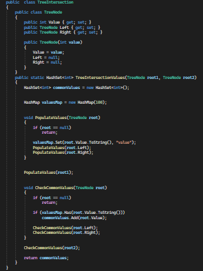
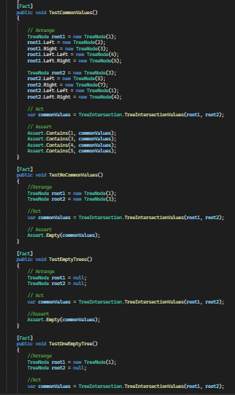

# Tree Intersection
+  Create TreeIntersection class with required implementation for Nodes and with a function that takes 2 binary trees and returns the common values in both trees
## Whiteboard Process

## Approach & Efficiency
+ TreeNode Class : create this class  to represent the nodes for the tree 
+ Create the TReeIntersection Method that returns HashSet with the common values and Takes 2 Nodes from binary trees.
+ Create HashSet<int> to store the common values found in both trees. 
+ Create PopulateValues Method for First Tree it  recursively populates values from the first tree (`root1`) into the `valuesMap` hashmap It uses a depth-first traversal approach to add values to the hashmap.
+ Create CheckCommonValues Method for Second Tree CheckCommonValues it  recursively checks for common values in the second tree (`root2`) while consulting the `valuesMap` hashmap.
 If a value from `root2` is found in the `valuesMap`, it is added to the `commonValues` HashSet.
+ REturn the common values .

## Solution
+ Code      

            

+ Testing               

