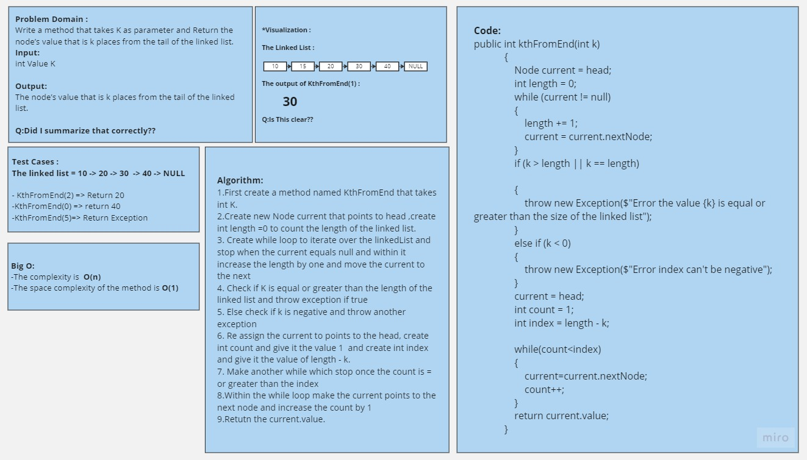
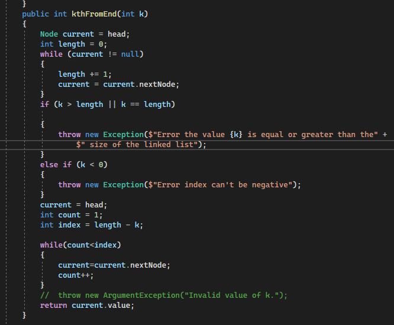
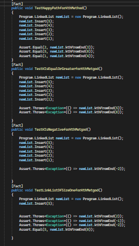

# Challenge Title
## Linked List KthFromEnd
+ Create a method to take K as integer and return the node's of K starting from Tail.

## Whiteboard Process

## Approach & Efficiency
+ First create a method named KthFromEnd that takes int K.
+ Create new Node current that points to head ,create int length =0 to count the length of the linked list.
+ Create while loop to iterate over the linkedList and stop when the current equals null and within it increase the length by one and move the current to the next
+ Check if K is equal or greater than the length of the linked list and throw exception if true
+ Else check if k is negative and throw another exception
+ Re assign the current to points to the head, create int count and give it the value 1  and create int index and give it the value of length - k.
+ Make another while which stop once the count is = or greater than the index
+ Within the while loop make the current points to the next node and increase the count by 1
+ Retutn the current.value.
#
## Solution
## The code 

## 
[Link to the code](/LinkedList/Program.cs)

## Testing

#
[Link to the testing](/testLinkedList/UnitTest1.cs)

