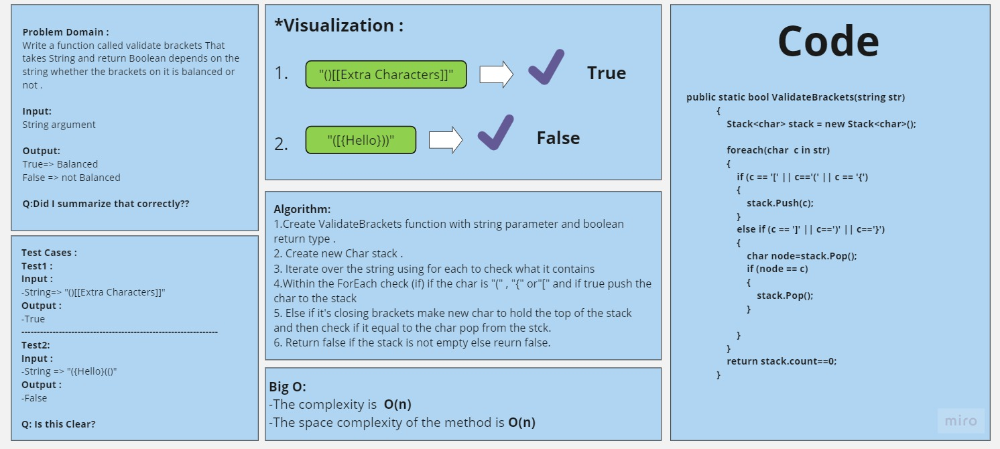
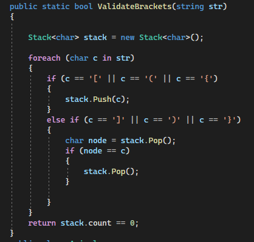
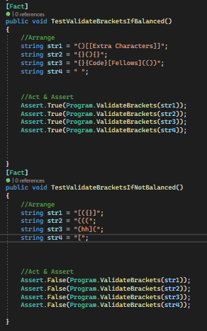

# Challenge Title
## Stack and Queue Brackets =>
I created a method ValidateBrackets that takes string and sheck if the brackets inside it is balanced or not and return boolean value.
## WhiteBoard Process =>

## Approach & Efficiency
+ Create ValidateBrackets function with string parameter and boolean return type .
+ Create new Char stack .
+ Iterate over the string using for each to check what it contains
+ Within the ForEach check (if) if the char is "(" , "{" or"[" and if true push the char to the stack
+ Else if it's closing brackets make new char to hold the top of the stack and then check if it equal to the char pop from the stck.
+ Return false if the stack is not empty else reurn false.
## Solution
# The code 

## 
[Link to the code](/LinkedList/Program.cs)

# Testing 

## 
[Link to the testing](/testLinkedList/UnitTest1.cs)
