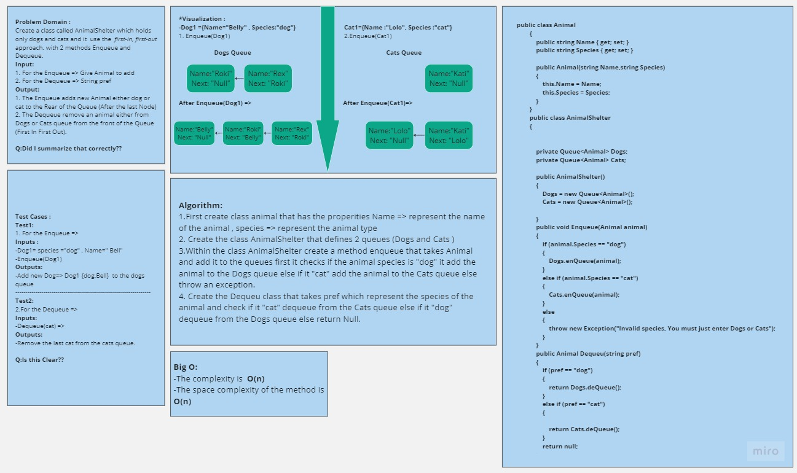
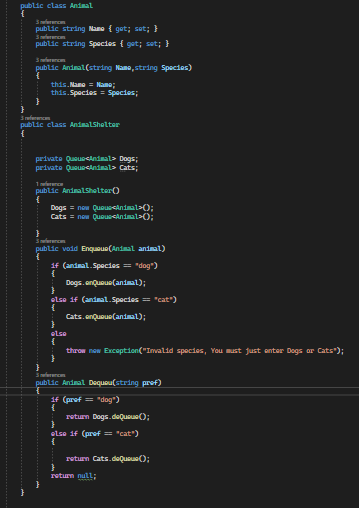

# Challenge Title
## Stack and Queue Animal Shelter =>
+ I Create a class (AnimalShelter) that takes just Ctas and Dogs Queues and contains 2 methods: 
  1. Dequeue=> which add animal to a specific queue based on it's species .
  2. Dequeue that removes specific animal from a specific Queue (Either Dogs or Ctas queue).

## WhiteBoard Process =>

## Approach & Efficiency
+ First create class animal that has the properities Name => represent the name of the animal , species => represent the animal type
+ Create the class AnimalShelter that defines 2 queues (Dogs and Cats )
+ Within the class AnimalShelter create a method enqueue that takes Animal and add it to the queues first it checks if the animal species is "dog" it add the animal to the Dogs queue else if it "cat" add the animal to the Cats queue else throw an exception.
+ Create the Dequeu class that takes pref which represent the species of the animal and check if it "cat" dequeue from the Cats queue else if it "dog" dequeue from the Dogs queue else return Null.

## Solution
+ The code 

## 
[Link to the code](/LinkedList/Program.cs)
