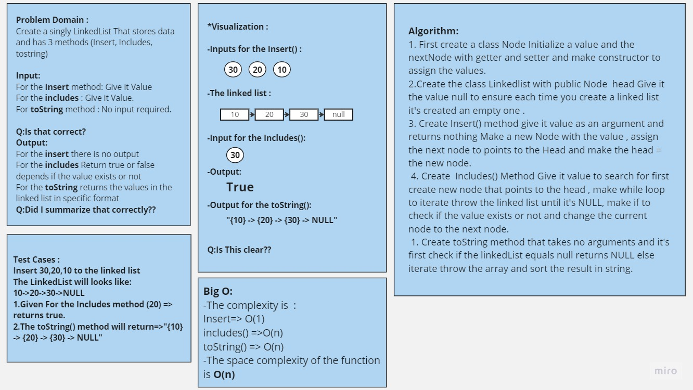
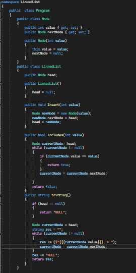
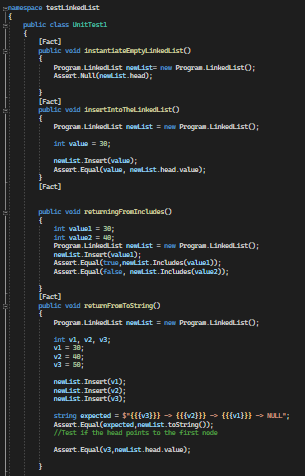

# Challenge Title
## Linked List
+ I created a simple singly Linked list and it's contain some features like the ability of insert a new node to the list, Search for a value to know if it included in the list or not and a it contains a method (toString()) that returns the values in the linked list

## Whiteboard Process

## Approach & Efficiency
+ First I created a class **Node** Which Initialize a value and the nextNode in the list 
+ Then the class **Linkedlist** which contains head that has the value null to ensure each time you create a linked list it's created an empty one.This class contains also a lot of methods  
+ 1. **Insert() method** It takes the value as an argument and returns nothing this method create new node with the given value, makes it points to the head then it changes the head to take the value of the new node.
	2. **Includes() Method** This method takes a value and checks if it exist in the linked list or not First it initialized a current node to point at the head and checks the nodes untill it's null if the value matches the values at the list returns true else retirns false and after each check it changed the current to points at the next node.
	1. **toString() Method** It returns the values in the linked list in specific format

## Solution
## The code 

## 
[Link to the code](./Program.cs)

## Testing

#
[Link to the testing](../testLinkedList/UnitTest1.cs)

